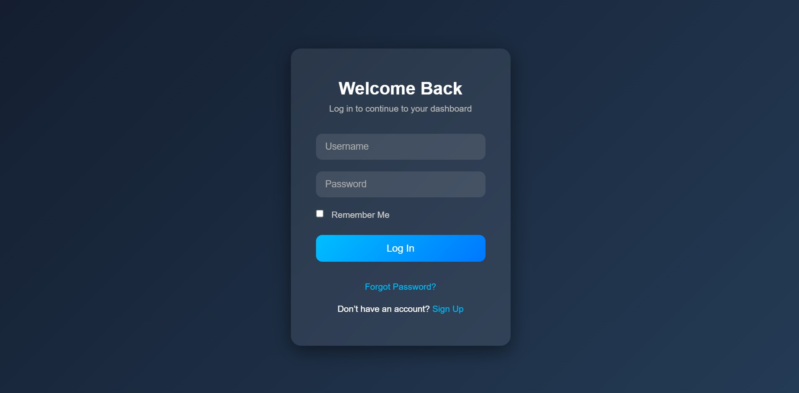

# 💎 Colm-Woods-Login

A sleek and responsive **glass-style login interface** featuring soft transparency, glowing input highlights, and a smooth fade-in animation over a **dark blue gradient background**.

---

## 💾 Project Structure

The project consists of two main files:

* `index.html` – The HTML structure for the login form.  
* `style.css` – The CSS styling for the glassmorphism design, gradient background, and animations.

---

## ✨ Features

* **Glassmorphism Design:** Transparent, frosted-glass style login card with subtle shadows and blur effects.  
* **Responsive Layout:** Automatically adjusts for desktops, tablets, and mobile devices.  
* **Interactive Elements:** Glowing focus effects on input fields and hover animations on the login button.  
* **Modern UI:** Rounded corners, gradients, and smooth transitions create a clean, professional look.  
* **Fade-in Animation:** The entire card animates gracefully on page load for a polished appearance.

---

## 🚀 Getting Started

To view and use this template, simply follow these steps:

1. **Clone or Download** the folder `Colm-Woods-Login` (contains `index.html` and `style.css`).  
2. **Open `index.html`** in any modern web browser.

No server or build tools are required — this project runs purely on **HTML and CSS**.

---

## ⚙️ Customization

| File | Area of Focus | Tip |
| :--- | :--- | :--- |
| `style.css` | **Color Theme** | Adjust the background gradient (`#141e30`, `#243b55`) or button colors for different moods. |
| `style.css` | **Glow & Blur** | Modify `box-shadow` and `backdrop-filter` values to increase or reduce the glass effect. |
| `index.html` | **Form Fields** | Add more input fields (e.g., Email, Confirm Password) or change placeholder text. |
| `style.css` | **Animations** | Adjust the `@keyframes fadeIn` duration for slower or faster transitions. |

---

## 🧠 Inspiration

Designed with modern UI principles, this template provides a **minimal yet visually engaging** authentication screen suitable for dashboards, portfolios, or web apps.
