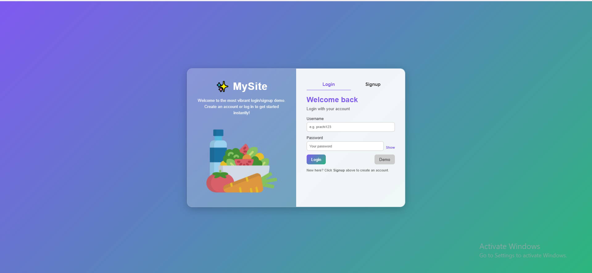

🌟 Sign-In / Sign-Up Page Template

A beautifully designed and fully responsive Sign-In / Sign-Up template built with pure HTML, CSS, and JavaScript — no frameworks, no dependencies.
This template features a modern glassmorphism UI, animated transitions, and an accessible layout that can easily be integrated into any project.

Features

Modern glassmorphism design with smooth gradients Animated form switching between Login and Signup Password visibility toggle for user convenience
Responsive layout — works perfectly on desktops, tablets, and phones

 Lightweight & fast — built with pure front-end technologies

 Easy to customize — change colors, fonts, and branding in seconds

 Demo autofill option for quick login testing

 Project Structure
signin-signup-template/
│
├── index.html        # Main HTML file (login/signup UI)
├── style.css         # Styling for layout, animations, and themes
├── script.js         # Logic for tabs, toggles, and interactions
└── README.md         # Project documentation

 Preview

You can open index.html directly in your browser to view the live template.

 How to Use

Clone or download this repository

Open the index.html file in your browser.

cd signin-signup-template
start index.html

Customize:

Change the brand name and logo in the .panel-left section.

Update colors and gradient in style.css.

Extend logic or integrate with your backend in script.js.

 Customization Tips

 Colors: Modify the gradient in the body CSS section.

 Branding: Replace MySite with your own brand or logo.

 Integration: Connect form submissions to your backend (Node.js, Django, Flask, Firebase, etc.).

 Screenshots (optional)

Example:

 Tech Stack

HTML5

CSS3 (Flexbox, Animations, Gradients)

Vanilla JavaScript (ES6)

 Future Improvements

 Dark mode toggle

 Form validation with error messages

 Backend authentication integration

 Theme switcher